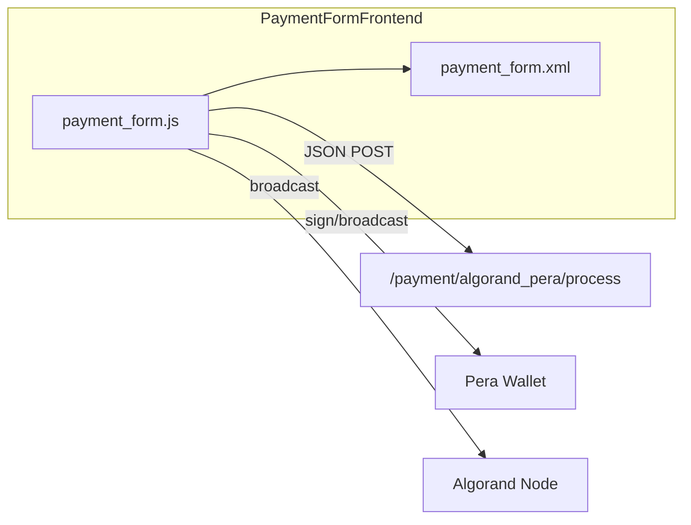

# C4 Component: Payment Form Frontend

## Overview

| Attribute | Value |
|-----------|--------|
| **Name** | Payment Form Frontend – Algorand Pera |
| **Description** | Checkout payment form UI: wallet connect, transaction build/sign/broadcast, and backend process call. |
| **Type** | Application (frontend) |
| **Technology** | JavaScript (OWL), CSS, Pera Wallet Connect, algosdk (browser) |

## Purpose

- Patch Odoo PaymentForm to add Algorand-specific initiation and direct flow.
- Read inline form values from QWeb-rendered container.
- Validate wallet connected, merchant address, and USDC opt-in before creating transaction.
- Build ALGO or USDC (ASA) transaction, sign with Pera Wallet, broadcast to Algorand.
- Call backend `/payment/algorand_pera/process` with tx_id, tx_hash, sender_address and handle redirect/status.

## Software Features

- _initiatePaymentFlow: wallet/merchant/ASA checks then super.
- _processDirectFlow: _processAlgorandPayment (build, sign, broadcast, process route).
- _getAlgorandFormValues from DOM.
- Wallet connect/disconnect UI and ASA opt-in handling.
- Error dialogs and inline messages.
- Optional AlgorandPaymentPopup (QR) for POS flow.

## Code Elements

| File | Description |
|------|-------------|
| [c4-code-static.md](c4-code-static.md) | payment_form.js, algorand_payment_popup.js, CSS, images, lib. |
| [c4-code-views.md](c4-code-views.md) | payment_form.xml (inline form container). |

## Interfaces

| Interface | Protocol | Description |
|-----------|----------|-------------|
| Inline form values | DOM data attribute | JSON on `o_algorand_element_container` (merchant_address, amount, node_url, is_asa, asset_id, etc.). |
| /payment/algorand_pera/process | JSON (HTTP POST) | Request: tx_id, tx_hash, sender_address, error_message. Response: {success, tx_id} or {error, message, type}. |
| Pera Wallet | Wallet Connect / SDK | Connect, sign transaction(s). |
| Algorand node | HTTP (algosdk) | Send raw signed transaction. |

## Dependencies

- **Components**: Views (inline form template).
- **External**: Odoo PaymentForm (patch), Pera Wallet Connect, algosdk (browser), Algorand node (configurable).

## Component Diagram

