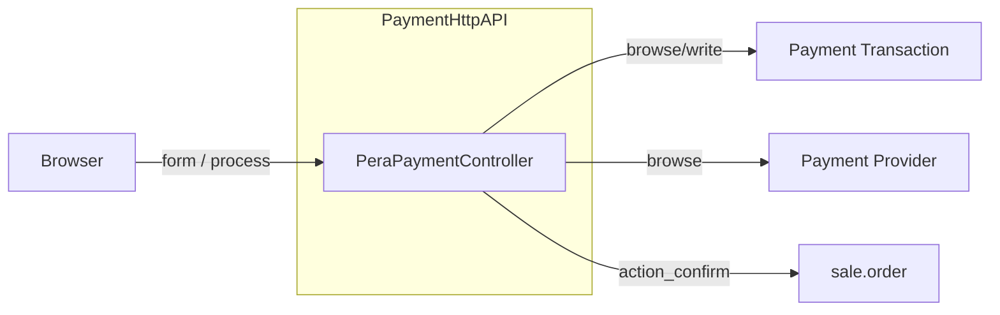

# C4 Component: Payment HTTP API

## Overview

| Attribute | Value |
|-----------|--------|
| **Name** | Payment HTTP API – Algorand Pera |
| **Description** | HTTP and JSON endpoints to display the payment form and process blockchain confirmation. |
| **Type** | Service (HTTP API) |
| **Technology** | Python, Odoo HTTP (werkzeug) |

## Purpose

- Serve the Algorand payment form page (GET/POST) with transaction and provider context.
- Accept JSON callback after user signs and broadcasts transaction: validate, update payment.transaction, monitor for status page, confirm sale order, return success/error.

## Software Features

- GET/POST /payment/algorand_pera/form: validate tx_id and reference, load transaction and provider, render payment form template.
- POST /payment/algorand_pera/process (JSON): validate payload, tx._process(), monitor_transaction(), confirm sale order if present, return JSON.

## Code Elements

| File | Description |
|------|-------------|
| [c4-code-controllers.md](c4-code-controllers.md) | main.py (PeraPaymentController). |

## Interfaces

| Interface | Protocol | Description |
|-----------|----------|-------------|
| GET /payment/algorand_pera/form | HTTP | Query: tx_id, reference. Response: HTML (payment form) or redirect /shop. |
| POST /payment/algorand_pera/form | HTTP | Same as GET (form display). |
| POST /payment/algorand_pera/process | JSON | Body: tx_id, tx_hash, sender_address, error_message. Response: {success, tx_id} or {error, message, type}. |

## Dependencies

- **Components**: Payment Transaction (read/update), Payment Provider (read), sale.order (confirm).
- **External**: Odoo request, render, redirect, env, session; PaymentPostProcessing.monitor_transaction.

## Component Diagram

