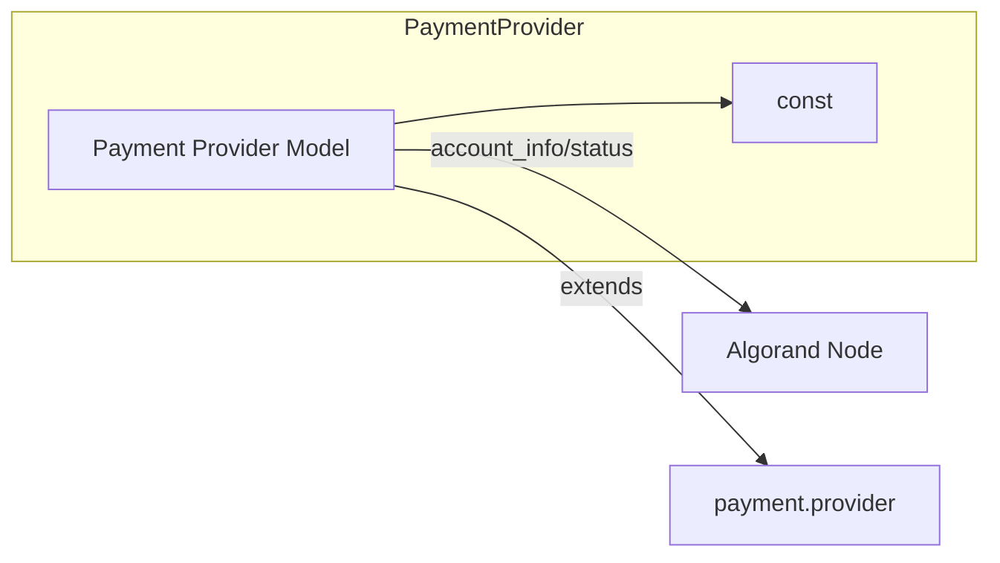

# C4 Component: Payment Provider (Algorand)

## Overview

| Attribute | Value |
|-----------|--------|
| **Name** | Payment Provider – Algorand Pera Wallet |
| **Description** | Configures and validates the Algorand payment provider (merchant address, network, node, USDC opt-in). |
| **Type** | Application (Odoo model extension) |
| **Technology** | Python, Odoo ORM, algosdk (optional) |

## Purpose

- Register "Algorand Pera Wallet" as a payment provider in Odoo.
- Store merchant Algorand address, network (testnet/mainnet), and node URL.
- Provide inline form values for the checkout payment form (amount, currency, merchant address, USDC ASA id).
- Validate merchant address and USDC opt-in; support admin actions (verify node, check USDC).
- Support only direct flow and USD (via USDC) as currency.

## Software Features

- Provider code selection: `algorand_pera`.
- Effective network from state (enabled → mainnet, else testnet).
- Default payment method codes and supported flows/currencies.
- Inline form values (JSON) for frontend (tx_id, merchant_address, amount, network, node_url, is_asa, asset_id).
- No external payment request: set transaction to pending.
- Constraint: merchant address required and 58 chars when enabled/test.
- USDC opt-in check via algod `account_info`.
- Actions: Verify node (algod status), Check USDC opt-in, Toggle published.

## Code Elements

| File | Description |
|------|-------------|
| [c4-code-const.md](c4-code-const.md) | Constants (USDC ASA IDs, payment method codes). |
| [c4-code-models.md](c4-code-models.md) | PaymentProvider in payment_provider.py. |

## Interfaces

| Interface | Protocol | Description |
|-----------|----------|-------------|
| Payment provider fields | Odoo ORM | algorand_merchant_address, algorand_network, algorand_node_url, image_128, code, state. |
| _algorand_get_inline_form_values | Python method | Returns JSON string for inline form (amount, currency, partner_id, is_validation, payment_method_sudo, **kwargs). |
| _get_supported_currencies / _get_supported_flows / _get_default_payment_method_codes | Python methods | Overrides for Algorand. |
| action_algorand_verify_node / action_algorand_check_usdc_optin | Odoo actions | Return client notifications. |
| Algod (read-only) | HTTP (algosdk) | account_info, status for USDC opt-in and node check. |

## Dependencies

- **Components**: Constants (const).
- **External**: Odoo payment.provider, res.currency, payment.transaction (read), algosdk.v2client.algod, Algorand public node (configurable URL).

## Component Diagram

