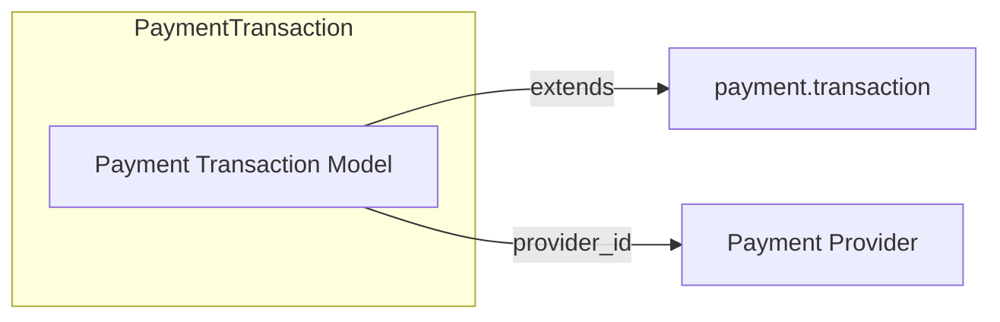

# C4 Component: Payment Transaction (Algorand)

## Overview

| Attribute | Value |
|-----------|--------|
| **Name** | Payment Transaction – Algorand |
| **Description** | Persists Algorand transaction id and sender; integrates with Odoo payment flow (processing values, apply updates, search by reference, notification). |
| **Type** | Application (Odoo model extension) |
| **Technology** | Python, Odoo ORM |

## Purpose

- Store Algorand-specific transaction data (algorand_tx_id, algorand_sender_address, algorand_network).
- Supply processing values for the inline payment form.
- Process callback data from frontend: extract tx_id and sender_address, update record, set state to done.
- Locate transaction by reference for processing and notification handling.

## Software Features

- Fields: algorand_tx_id, algorand_sender_address, algorand_network.
- _get_specific_processing_values for direct flow form.
- _extract_amount_data: trust transaction amount/currency for Algorand.
- _apply_updates: set provider_reference, algorand_tx_id, algorand_sender_address; _set_done().
- _search_by_reference: by reference + provider_code algorand_pera.
- _process_notification_data / _get_tx_from_notification_data for notification flow.
- _execute_callback delegates to super.

## Code Elements

| File | Description |
|------|-------------|
| [c4-code-models.md](c4-code-models.md) | PaymentTransaction in payment_transaction.py. |

## Interfaces

| Interface | Protocol | Description |
|-----------|----------|-------------|
| Transaction fields | Odoo ORM | algorand_tx_id, algorand_sender_address, algorand_network. |
| _get_specific_processing_values(processing_values) | Python | Returns dict tx_id, merchant_address, amount_algo, currency, order_id. |
| _extract_amount_data(payment_data) | Python | Returns amount, currency_code from transaction. |
| _apply_updates(payment_data) | Python | Expects payment_data with tx_id, sender_address; updates record and sets done. |
| _search_by_reference(provider_code, payment_data) | Python | Returns transaction(s) by reference. |
| _process_notification_data / _get_tx_from_notification_data | Python | Process notification and resolve transaction. |

## Dependencies

- **Components**: None (uses provider_id from same addon).
- **External**: Odoo payment.transaction, payment.provider.

## Component Diagram

