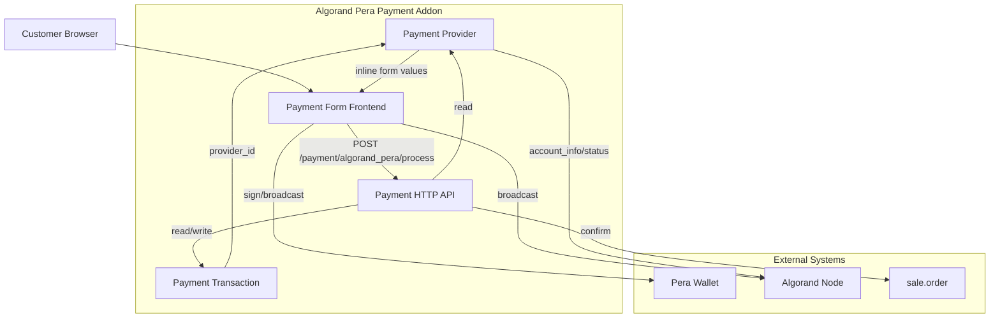

# C4 Master Component Index – Algorand Pera Payment

## System Components

| Component | Description | Documentation |
|-----------|-------------|---------------|
| Payment Provider (Algorand) | Configures merchant address, network, node URL; provides inline form values; validates USDC opt-in and node. | [c4-component-payment-provider.md](c4-component-payment-provider.md) |
| Payment Transaction (Algorand) | Stores Algorand tx id and sender; integrates with Odoo payment flow (processing values, apply updates, search, notification). | [c4-component-payment-transaction.md](c4-component-payment-transaction.md) |
| Payment Form Frontend | Checkout UI: wallet connect, build/sign/broadcast Algorand transaction, call process endpoint. | [c4-component-payment-form-frontend.md](c4-component-payment-form-frontend.md) |
| Payment HTTP API | Routes: display payment form, process JSON callback after blockchain confirmation. | [c4-component-payment-http-api.md](c4-component-payment-http-api.md) |

Supporting code-level docs (data, security, views, hooks, migrations, addon root) are consumed by the above components or by Odoo loader.

## Component Relationships Diagram

## Code-Level Documentation Index

| Document | Scope |
|----------|--------|
| [c4-code-addon-root.md](c4-code-addon-root.md) | __init__, __manifest__ |
| [c4-code-const.md](c4-code-const.md) | Constants |
| [c4-code-hooks.md](c4-code-hooks.md) | post_init_hook |
| [c4-code-models.md](c4-code-models.md) | payment_provider, payment_transaction, payment_method, res_config_settings |
| [c4-code-controllers.md](c4-code-controllers.md) | PeraPaymentController |
| [c4-code-static.md](c4-code-static.md) | JS, CSS, images, lib |
| [c4-code-views.md](c4-code-views.md) | QWeb and backend views |
| [c4-code-data.md](c4-code-data.md) | payment_provider_data, payment_method_data |
| [c4-code-security.md](c4-code-security.md) | ir.model.access.csv |
| [c4-code-migrations.md](c4-code-migrations.md) | 19.0.1.0.0 post-migration |
