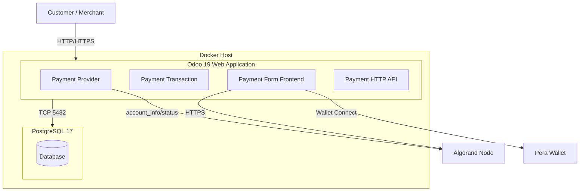

# C4 Container Level – AlgoBizSuite

## Containers

### 1. Odoo 19 Web Application

| Attribute | Value |
|-----------|--------|
| **Name** | Odoo 19 |
| **Description** | Odoo 19 server running the Algorand Pera Payment addon; serves website, backend UI, and payment HTTP/JSON routes. |
| **Type** | Web Application |
| **Technology** | Python 3, Odoo 19, Werkzeug |
| **Deployment** | Docker (image odoo:19), optional custom Dockerfile with entrypoint and addons mount |

**Purpose**

- Host Odoo core, website_sale, payment, and algorand_pera_payment addon.
- Serve checkout pages, payment form, and `/payment/algorand_pera/*` routes.
- Run post_init_hook and migrations on upgrade.
- Connect to PostgreSQL for persistence.

**Components deployed in this container**

| Component | Documentation |
|-----------|---------------|
| Payment Provider (Algorand) | [c4-component-payment-provider.md](c4-component-payment-provider.md) |
| Payment Transaction (Algorand) | [c4-component-payment-transaction.md](c4-component-payment-transaction.md) |
| Payment Form Frontend | [c4-component-payment-form-frontend.md](c4-component-payment-form-frontend.md) |
| Payment HTTP API | [c4-component-payment-http-api.md](c4-component-payment-http-api.md) |

**Interfaces**

| API / Interface | Protocol | Description | Spec |
|-----------------|----------|-------------|------|
| Payment form | HTTP GET/POST | Display Algorand payment form (tx_id, reference). | [apis/odoo19-payment-algorand-api.yaml](apis/odoo19-payment-algorand-api.yaml) |
| Payment process | JSON POST | Process callback after blockchain confirmation. | [apis/odoo19-payment-algorand-api.yaml](apis/odoo19-payment-algorand-api.yaml) |
| Odoo backend UI | HTTP | Admin: Payment Providers, Transactions, Settings. | Odoo standard |
| Website / Shop | HTTP | Catalog, cart, checkout (website_sale). | Odoo standard |

**Dependencies**

- **Containers**: PostgreSQL (database).
- **External**: Algorand public node (configurable URL, e.g. algonode.cloud), Pera Wallet (client-side; not a server dependency).

**Infrastructure**

- **Deployment**: Docker Compose (`docker-compose.yml`), optional `Dockerfile` (FROM odoo:19, COPY etc, addons, entrypoint).
- **Scaling**: Single process per container; horizontal scaling via multiple Odoo workers / load balancer if needed.
- **Resources**: Mounts `./addons` as `/mnt/extra-addons`, `./etc` as `/etc/odoo`; env from `.env`.

---

### 2. PostgreSQL Database

| Attribute | Value |
|-----------|--------|
| **Name** | PostgreSQL 17 |
| **Description** | Database for Odoo (including payment providers, transactions, sale orders). |
| **Type** | Database |
| **Technology** | PostgreSQL 17 |
| **Deployment** | Docker (image postgres:17) |

**Purpose**

- Persist Odoo data: payment.provider, payment.transaction, payment.method, sale.order, ir.config_parameter, etc.
- Used by Odoo 19 container via connection string (RDS_HOST, USER, PASSWORD).

**Interfaces**

- PostgreSQL protocol (TCP 5432); credentials from environment.

**Dependencies**

- None (leaf).

**Infrastructure**

- Docker Compose service `db`; volume `./postgresql` for data persistence.

---

## Container Diagram

## Related Documentation

- [c4-component.md](c4-component.md) – Master component index
- [c4-context.md](c4-context.md) – System context, personas, user journeys
