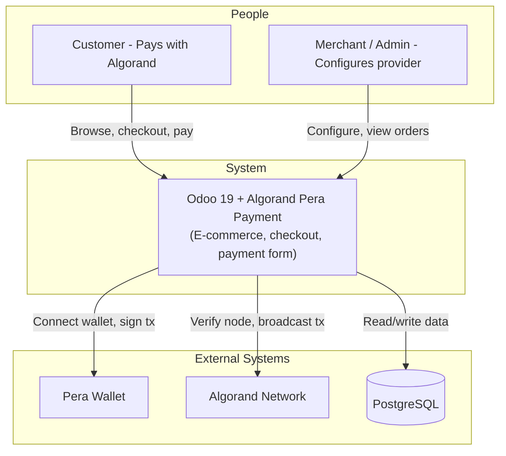

# C4 Context Level – AlgoBizSuite (Odoo 19 + Algorand Pera Payment)

## System Overview

**Short description**  
AlgoBizSuite is an Odoo 19 e-commerce environment that lets merchants accept ALGO and USDC payments via Algorand Pera Wallet at checkout.

**Long description**  
The system consists of an Odoo 19 deployment (website, shop, payment) and the **Algorand Pera Payment** addon. Merchants configure a payment provider with their Algorand address and network (TestNet/MainNet). Customers choose “Algorand Pera Wallet” at checkout, connect their Pera Wallet, sign the payment (ALGO or USDC), and the addon records the transaction and confirms the order. The addon does not run a separate payment server; it extends Odoo’s payment and website_sale stack and uses the Algorand blockchain and Pera Wallet for settlement and UX.

---

## Personas

| Persona | Type | Description | Goals |
|---------|------|-------------|--------|
| **Customer** | Human User | Shopper on the merchant’s Odoo website. | Pay with ALGO or USDC via Pera Wallet; complete checkout and get order confirmation. |
| **Merchant / Admin** | Human User | Odoo backend user (e.g. Accounting/Payment). | Enable Algorand Pera Wallet provider; set merchant address and node; verify node and USDC opt-in; publish provider for customers. |
| **Pera Wallet (User’s)** | Programmatic / End-User | Customer’s Pera Wallet (mobile or web). | Connect to site; sign Algorand transactions; broadcast to network. |
| **Algorand Network** | External System | Public Algorand blockchain (TestNet/MainNet). | Provide node API (algod) for account info and transaction broadcast; settle ALGO and ASA (USDC) transfers. |

---

## System Features

| Feature | Description | Users |
|---------|-------------|--------|
| Algorand Pera Wallet payment | Accept ALGO and USDC at checkout via Pera Wallet. | Customer |
| Payment provider configuration | Set merchant address, network, node URL; verify node and USDC opt-in; publish. | Merchant / Admin |
| Checkout payment form | Inline form: connect wallet, choose ALGO/USDC, sign and broadcast, then redirect to status/confirmation. | Customer |
| Order confirmation | Sale order confirmed and cart cleared after successful payment; transaction id stored and visible. | Customer, Merchant |
| Transaction and provider data | Stored in Odoo (payment.transaction, payment.provider) and visible in backend. | Merchant / Admin |

---

## User Journeys

### 1. Configure Algorand Provider – Merchant / Admin Journey

1. Log in to Odoo backend.
2. Go to **Website → Configuration → Payment Providers** (or **Accounting → Configuration → Payment Providers**).
3. Select **Algorand Pera Wallet** (or create/enable it).
4. Set **Merchant Algorand Address** (58-character address).
5. Set **Algorand Network** (TestNet / MainNet) and ensure **Algorand Node URL** is correct (or use default).
6. Click **Verify Node** to check node reachability.
7. For USD/USDC: click **Check USDC Opt-in Status**; opt in to USDC if needed.
8. Publish the provider so it appears at checkout.
9. (Optional) Configure journal and other accounting settings per Odoo payment.

### 2. Pay with Algorand – Customer Journey

1. **Browse & cart**: Customer browses shop, adds products to cart.
2. **Checkout**: Goes to checkout, fills delivery/billing if required.
3. **Payment step**: Selects **Algorand Pera Wallet** as payment method.
4. **Connect wallet**: Connects Pera Wallet (QR or web); wallet address shown.
5. **Review**: Sees amount, currency (ALGO or USDC), merchant address; for USDC, opt-in is checked.
6. **Pay**: Clicks pay; Pera Wallet prompts to sign transaction; customer signs; transaction is broadcast to Algorand.
7. **Confirmation**: Frontend calls backend with tx hash and sender; order is confirmed; customer is redirected to payment status / confirmation page; cart is cleared.
8. **Receipt**: Order confirmation and transaction id (e.g. AlgoExplorer link) available as configured.

### 3. Process Payment (System) – Programmatic Journey

1. Frontend has tx_id (Odoo payment.transaction id) and reference from form.
2. After user signs and broadcast, frontend receives tx_hash and sender_address from wallet/network.
3. Frontend POSTs to `/payment/algorand_pera/process` with tx_id, tx_hash, sender_address.
4. Odoo loads transaction, calls `_process("algorand_pera", data)`; transaction state set to done; provider_reference and algorand fields stored.
5. Transaction is registered for payment status page; sale order is confirmed if in session.
6. Response `{success: true, tx_id: tx_hash}`; frontend redirects to status/confirmation.
7. Cron/post-processing (Odoo standard) creates account.payment and reconciles as per provider/journal configuration.

---

## External Systems and Dependencies

| System | Type | Description | Integration | Purpose |
|--------|------|-------------|-------------|---------|
| **Algorand Node (algod)** | API (HTTP) | Public Algorand API (e.g. algonode.cloud). | algosdk (backend: account_info, status; frontend: send_raw_transaction). | Verify node, check USDC opt-in, broadcast signed transactions. |
| **Pera Wallet** | Client-side (Wallet Connect / SDK) | User’s wallet (mobile or web). | Browser: Pera Wallet Connect / SDK; user signs in wallet. | Sign and (with frontend) broadcast payment transactions. |
| **Odoo payment / website_sale** | Upstream Odoo modules | Core payment and e-commerce. | Addon depends on and extends payment, website_sale. | Checkout flow, payment provider/transaction model, status page, cart. |
| **PostgreSQL** | Database | Odoo database. | Odoo ORM. | Persist providers, transactions, orders, config. |

---

## System Context Diagram

**C4 Context (conceptual):** The system is **Odoo 19 + Algorand Pera Payment**. People (Customer, Merchant/Admin) use it; it uses Pera Wallet (user’s), Algorand Network, and PostgreSQL.

---

## Related Documentation

- [c4-container.md](c4-container.md) – Containers (Odoo 19, PostgreSQL) and deployment
- [c4-component.md](c4-component.md) – Component index and relationships
- [README.md](../README.md) – Project quick start, configuration, development
