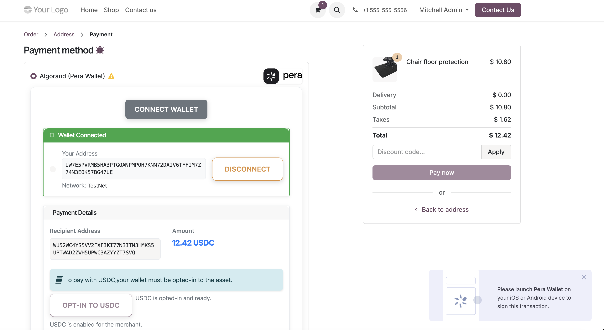
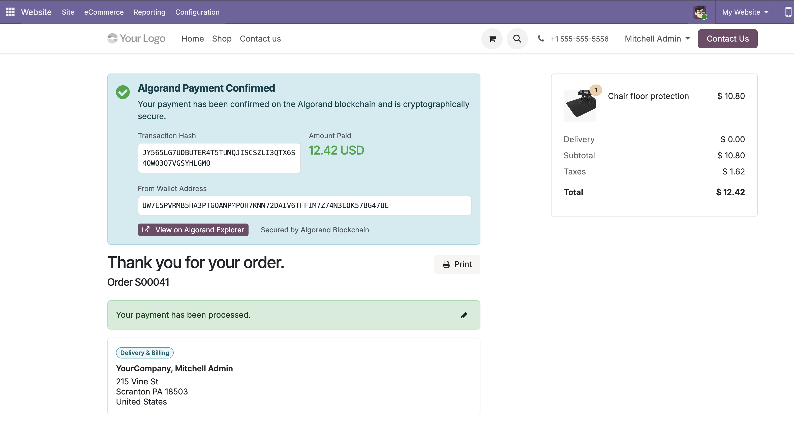

# AlgoBizSuite - Odoo 19 with Algorand Payments

Docker-based Odoo 19 development environment featuring Algorand Pera Wallet payment integration for accepting ALGO and USDC payments in your e-commerce store.

## Table of Contents

- [Algorand Pera Payment Module](#algorand-pera-payment-module)
- [Quick Start](#quick-start)
- [Configuration](#configuration)
- [Development](#development)
- [Manual Setup](#manual-setup)
- [Troubleshooting](#troubleshooting)
- [Resources](#resources)

## Algorand Pera Payment Module

Accept cryptocurrency payments (ALGO and USDC) in your Odoo store via Pera Wallet.



### Key Features

- ✅ **ALGO Payments** - Native Algorand cryptocurrency
- ✅ **USDC Payments** - Stablecoin via Algorand Standard Assets
- ✅ **Fast Transactions** - ~3.7 second confirmation
- ✅ **Low Fees** - Less than $0.01 per transaction
- ✅ **TestNet & MainNet** - Full testing environment support

### Documentation

Comprehensive guides available in [`addons/algorand_pera_payment/readme/`](addons/algorand_pera_payment/readme/):

- **[Description](addons/algorand_pera_payment/readme/DESCRIPTION.md)** - Features and benefits
- **[Installation](addons/algorand_pera_payment/readme/INSTALL.md)** - Prerequisites and setup steps
- **[Configuration](addons/algorand_pera_payment/readme/CONFIGURE.md)** - Network setup, USDC opt-in, merchant address
- **[Usage](addons/algorand_pera_payment/readme/USAGE.md)** - Payment flow, customer experience, error handling
- **[History](addons/algorand_pera_payment/readme/HISTORY.md)** - Changelog and version history
- **[Contributors](addons/algorand_pera_payment/readme/CONTRIBUTORS.md)** - Project contributors

Full API documentation: [README.rst](addons/algorand_pera_payment/README.rst)

### Quick Configuration

**📸 [Complete Configuration Guide →](addons/algorand_pera_payment/readme/CONFIGURE.md)**


**5 Simple Steps**:

1. **Login to Odoo** - Access your admin panel
2. **Navigate to Payment Providers** - Website → Configuration → Payment Providers
3. **Select Algorand Pera Wallet** - Choose from available providers
4. **Configure Merchant Address** - Set your wallet address and node URL
5. **Publish Provider** - Enable for customers

**Basic Configuration Steps**:

1. **Configure merchant address**:
   - Go to Website → Configuration → Payment Providers
   - Select "Algorand Pera Wallet"
   - Set your Algorand wallet address (58 characters)
   - Click "Check USDC Opt-in Status" and "Verify Node"

2. **Choose network**: 
   - TestNet (testing): `https://testnet-api.algonode.cloud`
   - MainNet (production): `https://mainnet-api.algonode.cloud`

3. **For USD payments**: Opt-in to USDC
   - TestNet USDC: Asset ID `10458941`
   - MainNet USDC: Asset ID `31566704`

👉 **See the [Complete Configuration Guide with Screenshots](addons/algorand_pera_payment/readme/CONFIGURE.md) for detailed instructions**

### Customer Payment Flow

**📸 [Complete Payment Flow Guide →](addons/algorand_pera_payment/readme/USAGE.md)**



**6-Step Payment Journey**:

1. **Browse & Shop** → Customer browses products and adds items to cart
2. **Checkout** → Review order and proceed to payment
3. **Connect Wallet** → Scan QR code or connect Pera Wallet via web
4. **Review Payment** → See payment details, merchant address, and amount
5. **Complete Payment** → Sign transaction in Pera Wallet (for USDC: opt-in if needed)
6. **Confirmation** → Instant confirmation with blockchain transaction hash

**Key Benefits**:
- ⚡ **Fast**: ~3.7 seconds confirmation time
- 💰 **Low Cost**: Less than $0.01 per transaction
- 🔒 **Secure**: Cryptographically verified on Algorand blockchain
- ✅ **Easy**: Simple QR code or web wallet connection
- 📱 **Mobile-Friendly**: Works seamlessly with Pera mobile app

**Transaction Details Included**:
- Transaction note contains: host, amount, currency, and order reference
- View full transaction on [Algorand Explorer](https://algoexplorer.io/)
- Automatic order confirmation and email notification

👉 **See the [Complete Payment Flow with Screenshots](addons/algorand_pera_payment/readme/USAGE.md) for the full customer journey**

## Quick Start

**Prerequisites**: Docker 20.10+, Docker Compose 2.0+

### Automated Installation (Recommended)

**One-time setup - installs and configures everything!** 🚀

```bash
git clone https://github.com/SebaSco2/algobizsuite.git
cd algobizsuite
./install.sh
```

The `install.sh` script automatically:
- ✅ Checks Docker is running
- ✅ Creates configuration files from examples
- ✅ Installs Algorand Pera Payment module
- ✅ Starts all services
- ✅ Displays configuration instructions

Then open http://localhost:8069 and you're ready to go!

💡 **Note**: Uses default passwords. Change them in `.env` for production use.

### Managing Services After Installation

Once installed, use these commands to manage your Odoo instance:

```bash
# Start services
docker-compose up -d

# Stop services
docker-compose down

# View logs
docker-compose logs -f odoo19

# Restart services
docker-compose restart

# Stop and remove all data (fresh start)
docker-compose down -v
```

## Configuration

### Environment Variables

⚠️ **Important**: Configuration files are not included in the repository for security. You must create them from the examples.

**Required files**:
- `.env` - Environment variables (from `.env.example`)
- `docker-compose.yml` - Docker config (from `docker-compose.yml.example`)
- `etc/odoo.conf` - Odoo config (from `etc/odoo.conf.example`)

**Default settings**:
- **Database**: PostgreSQL 17 on port 5432
- **Odoo**: http://localhost:8069
- **User**: `odoo`

All passwords are configured via `.env` file for security.

### Python Dependencies

Automatically installed on startup from `etc/requirements.txt`:
- `py-algorand-sdk==2.11.1` - Algorand blockchain SDK
- `inotify`, `watchdog` - File system monitoring

## Development

### Common Commands

```bash
# Start/stop
docker-compose up -d
docker-compose down

# View logs
docker-compose logs -f odoo19

# Restart after code changes
docker-compose restart odoo19

# Access container
docker-compose exec odoo19 bash

# Access database
docker-compose exec db psql -U odoo -d postgres
```

### Adding Custom Addons

Place addons in `addons/` directory, restart, and update apps list in Odoo

## Docker Commands Reference

```bash
# Build custom image
docker build -t odoo:19-custom .

# Rebuild and restart
docker-compose up -d --build

# Clean slate (⚠️ deletes all data)
docker-compose down -v
rm -rf postgresql/* test_installation/*
```

## Manual Setup

If you prefer manual setup instead of using `install.sh`:

1. **Clone the repository**:
   ```bash
   git clone https://github.com/SebaSco2/algobizsuite.git
   cd algobizsuite
   ```

2. **Set up environment variables**:
   ```bash
   # Copy the example environment file
   cp .env.example .env
   
   # Edit .env and set your passwords
   nano .env
   ```
   
   Update these values in `.env`:
   ```env
   POSTGRES_PASSWORD=your_secure_password
   ODOO_ADMIN_PASSWORD=your_admin_password
   DB_PASSWORD=your_secure_password
   ```

3. **Set up configuration files**:
   ```bash
   # Copy example configuration files
   cp docker-compose.yml.example docker-compose.yml
   cp etc/odoo.conf.example etc/odoo.conf
   
   # Edit etc/odoo.conf and update passwords to match your .env
   nano etc/odoo.conf
   ```
   
   Update these values in `etc/odoo.conf` to match your `.env`:
   ```ini
   admin_passwd = your_admin_password
   db_password = your_secure_password
   ```

4. **Start the environment**:
   ```bash
   docker-compose up -d
   ```

5. **Access Odoo**: 
   - Navigate to http://localhost:8069
   - Create/select database (use the admin password from your `.env`)

6. **Install the Algorand module**:
   - Go to **Apps** → Update Apps List
   - Search "Algorand Pera Payment" → Install
   - See [Installation Guide](addons/algorand_pera_payment/readme/INSTALL.md)

## Troubleshooting

**Services stopped after reboot**: Restart them with `docker-compose up -d`

**Missing configuration files**: Run `./install.sh` or create them manually:
```bash
cp .env.example .env
cp docker-compose.yml.example docker-compose.yml
cp etc/odoo.conf.example etc/odoo.conf
# Edit .env with your passwords
```

**Container won't start**: Check logs with `docker-compose logs odoo19`

**Port conflicts**: Modify ports in `docker-compose.yml`

**Module not visible**: Restart container and update apps list in Odoo

**Permission errors**: `chmod +x install.sh entrypoint.sh`

**Fresh start**: 
```bash
docker-compose down -v
rm -rf postgresql/* test_installation/*
./install.sh
```

## Resources

- 📖 [Odoo 19 Documentation](https://www.odoo.com/documentation/19.0/)
- 🐋 [Docker Documentation](https://docs.docker.com/)
- 🔗 [Algorand Developer Portal](https://dev.algorand.co/)
- 🤝 [OCA Guidelines](https://github.com/OCA/maintainer-tools)
- 💬 [Contributing Guide](CONTRIBUTING.md)

## License

AGPL-3.0 - see [LICENSE](LICENSE) file.

## Support

- **Odoo Issues**: [Official Documentation](https://www.odoo.com/documentation/19.0/)
- **Algorand Payment Module**: See [module documentation](addons/algorand_pera_payment/readme/)
- **Project Issues**: [GitHub Issues](../../issues)

---

**Made with ❤️ for the Odoo and Algorand communities**