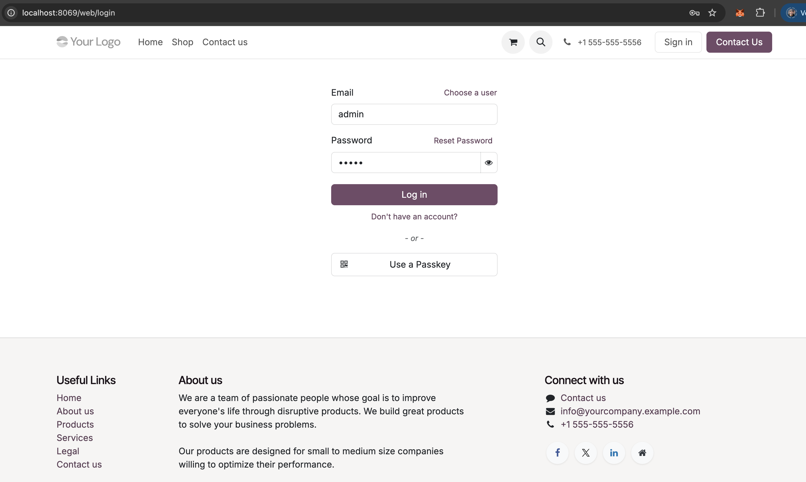

Configuration Guide
===================

This guide will walk you through configuring the Algorand Pera Wallet payment provider in Odoo.

Step-by-Step Configuration
---------------------------

### Step 1: Login to Odoo

Log in to your Odoo instance with administrator credentials.

### Step 2: Navigate to Payment Providers

Go to **Website > Configuration > Payment Providers**

### Step 3: Select Algorand Pera Wallet

Find and click on **Algorand Pera Wallet** from the list of available payment providers.

### Step 4: Configure Merchant Address

In the provider configuration page:

1. Set the **State** to either:
   - **Test Mode** (for testing on TestNet)
   - **Enabled** (for production on MainNet)

2. Enter your **Merchant Algorand Address** (required, 58 characters)

3. Configure the **Algorand Node URL**:
   - TestNet: `https://testnet-api.algonode.cloud`
   - MainNet: `https://mainnet-api.algonode.cloud`

4. Click **"Check USDC Opt-in Status"** to verify your USDC configuration

5. Click **"Verify Node"** to test the node connection

### Step 5: Publish the Provider

Once configured, the provider will show as **Published** and ready to accept payments.

Merchant Address Configuration (Required)
==========================================

**Important**: The merchant Algorand address is **required** to enable or test the payment provider.

The module will validate that:

1. **Address is configured**: You cannot enable the provider without setting a merchant address
2. **Address format is valid**: Algorand addresses must be exactly 58 characters long
3. **Address exists on blockchain**: The address should be a valid Algorand account

Network Configuration
====================

TestNet (for testing)
---------------------

For testing purposes, use the following configuration:

* **Network**: TestNet
* **Node URL**: `https://testnet-api.algonode.cloud`
* **Merchant Address**: Your TestNet wallet address (required)

You can get free TestNet ALGO from: https://bank.testnet.algorand.network/

MainNet (for production)
------------------------

For production use:

* **Network**: MainNet
* **Node URL**: `https://mainnet-api.algonode.cloud`
* **Merchant Address**: Your MainNet wallet address (required, ensure you have this address secured)

USDC Payments (USD Currency)
=============================

To accept **USD payments** via USDC on Algorand:

**Requirement**: Your merchant wallet **must be opted-in** to the USDC asset.

Checking USDC Opt-in Status
----------------------------

The module provides an automatic check:

1. Go to your Algorand Pera Wallet provider configuration
2. Click the **"Check USDC Opt-in Status"** button
3. The system will query the Algorand blockchain and display:
   - ✓ **Success**: If your address is opted-in to USDC
   - ✗ **Warning**: If your address is NOT opted-in to USDC

USDC Asset IDs
--------------

* **MainNet USDC** (Circle): Asset ID `31566704`
* **TestNet USDC**: Asset ID `10458941`

How to Opt-in to USDC
----------------------

To opt-in to USDC in your merchant wallet:

1. Open your Pera Wallet mobile app or web wallet
2. Go to "Add Asset" or "Asset Opt-in"
3. Search for "USDC"
4. Select the official USDC asset (verify the Asset ID matches above)
5. Complete the opt-in transaction (requires a minimal ALGO balance for the transaction fee)

**Note**: You can always accept **ALGO payments** without USDC opt-in. USDC opt-in is only required for USD currency payments.

Validation and Error Handling
==============================

The module performs the following validations:

**When Enabling the Provider**:
- ✓ Merchant address must be configured
- ✓ Merchant address must be exactly 58 characters
- ✓ Address format must be valid

**During Payment Processing**:
- ✓ System checks customer wallet USDC opt-in for USD payments
- ✓ System checks merchant wallet USDC opt-in for USD payments
- ✓ Customers are prompted to opt-in if needed
- ✓ Clear error messages are displayed if requirements are not met

Security Considerations
=======================

* **Never share your private keys**: Pera Wallet handles signing on the customer side
* **Verify merchant address**: Double-check your merchant address configuration using the validation buttons
* **Test thoroughly**: Always test on TestNet before going live on MainNet
* **Monitor transactions**: Set up monitoring for incoming payments
* **Keep backups**: Maintain secure backups of your wallet recovery phrase
* **Verify USDC opt-in**: Always check your USDC opt-in status before accepting USD payments

